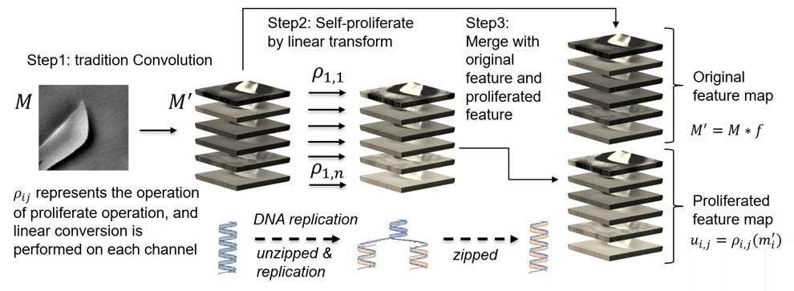
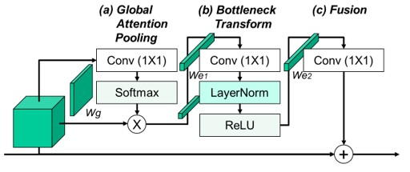
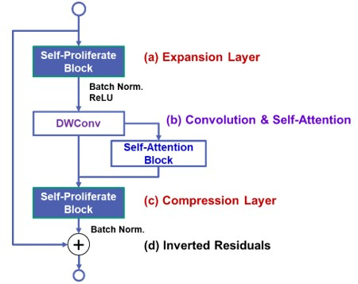

## Hybrid classical-quantum deep learning
### Official PennyLane and Tensorflow implementation of the paper: "Semiconductor Defect Detection by Hybrid Classical-Quantum Deep Learning"

## Architecture
Hybrid classical-quantum deep learning (HCQDL) consists of classical layer, quantum layer, and fully connection layer. The classical layer is implemented by the self-proliferation and self-attention block that used to extract feature maps effectively. The quantum layer is composed of the quantum circuit that can generate highly complex kernels whose calculations could be classically intractable. The fully connection layer is implemented by the non-linear activation functions to calculate the probability of various semiconductor defect. To demonstrate the power of the proposed method, we present results of using HCQDL to generate eigenstates of simple molecules, complex entangled ground states, and ground states of the transverse Hamiltonian with varying local fields and spin-spin couplings. The approach achieved high accurate results and can be generalized for creating quantum states of complex systems. Plz refer to ```Hybrid_CNN.py```


### Classical Layer
* The first function of SP&A-Net is the self-proliferation, using a series of linear transformations to generate more feature maps at a cheaper cost. We can train image classifier in a more efficient way. Plz refer to ```Self_Proliferate.py```


* The second function is self-attention, capturing the long-range dependencies of the feature map using the channel-wise and spatial attention mechanism. Plz refer to ```Self_Attention.py```


* SP&A Block
Plz refer to ```Self_Proliferate_and_Attention.py```


### Quantum Layer
The quantum layer implemented by various quantum circuit built in the continuous-variable architecture. It consists of three consecutive parts. An encoding circuit encodes classical data to states of the qubits followed by a parametrized quantum circuit (PQC) that is applied to transform these states to their optimal location on the Hilbert space. Finally, measure the output of PQC along the z-axis with the σz operator. Plz refer to ```quantum_circuit.py```


## Code

### Install dependencies

```
python -m pip install -r requirements.txt
```

This code was tested with python 3.7  


## Script Introduction

```Self_Proliferate.py``` is used to generate more feature maps (As paper section 3.1).

```Self_Attention.py``` is used to capturing the long-range dependencies of the feature map (As paper secton 3.1).

```Self_Proliferate_and_Attention.py``` follow the spirit of MobileNet,  "capture features in high dimensions and transfer information in low dimensions",  to make the network more efficient. (As paper secton 3.1).

```quantum_circuit.py``` is an example of quantum layer in the hybrid classical-quantum deep learning (as section 3.2).

```Hybrid_CNN.py``` is the hybrid classical-quantum deep learning with quantum layer and classical layer (as section 3).

```CircleLoss.py``` is used to estimate the loss rate during model training with two elemental deep feature learning approaches: class-level labels and pair-wise labels (as section 3-E).
